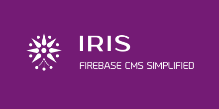

# IRIS CMS
<p align="center">
  
</p>

IRIS CMS is Content Management System that based on firebase.
So this Package depends Heavily on [Firebase Ecosystem ]([https://link](https://firebase.google.com/)).

Inspired by Flamelink but better & of course  <font size="5"> **FREE!!!** </font>

Created WITH ♡ ♥💕❤😘

# ⚠️WARNING⚠️
THIS PACKAGE IS STILL IN DEVELOPMENT ITS NOT READY FOR PRODUCTION YET.

# Dependency
```json
{
    "firebase": "7.13.2",
    ...& other
}
```


